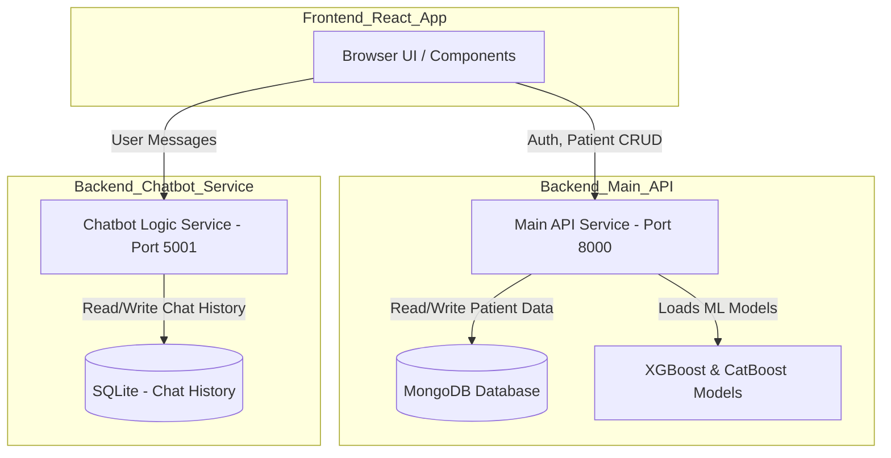

# 🧠 Alzheimer's Multi-Modal Diagnostic Portal (AMDP)

**Final Year Project: Full-Stack AI Application**

---

## 💡 Project Overview

This project provides a robust, clinical-grade web application for the precise diagnosis and staging of Alzheimer's Disease (AD) based on patient-specific clinical and genetic markers (CSV data). It is designed as a secure portal for clinicians, offering both rapid binary classification and detailed multi-class stage identification.

The application uses a **Microservices** approach to run the prediction engine and the support chatbot separately, ensuring high stability.

## ✨ Key Features

* **Dual Classification:** Runs two distinct machine learning models concurrently:
    * **Binary Model (XGBoost):** Determines if the patient is **AD** or **Non-AD (Normal)**.
    * **Multi-Class Model (CatBoost):** Identifies the disease stage (**Very Mild, Mild, Moderate, etc.**) for positive cases.
* **Explainable AI (XAI):** The "Most Recent Analysis" section displays a **Feature Importance Bar Chart** showing the top factors from the CSV data that influenced the model's decision.
* **Patient Management (CRUD):** Secure, authenticated system to create, view, update, and delete patient records.
* **PDF Reporting:** Generates a clean, downloadable PDF report of the patient's diagnostic results and history.
* **AI Chat Assistant :** A reliable, local logic-based assistant using RAG LLMs to provide immediate answers regarding symptoms, care, and medication, without crashing due to external API dependencies.
* **Dynamic Theming:** Includes a Light/Dark mode toggle for user preference.

---

## 🛠️ Tech Stack & Architecture

### 📊 Technology Stack

| Category | Primary Technology | Libraries / Details |
| :--- | :--- | :--- |
| **Frontend** | **React & Vite** | Material-UI (MUI), React Router, Chart.js, jsPDF. |
| **Prediction API** | **Python & FastAPI** | MongoDB, XGBoost, CatBoost, Joblib, Pandas. |
| **Chatbot Logic** | **Python (Logic-Based)** | Pure Python keywords for quick response simulation. |
| **Database** | **MongoDB** (Main App) | Stores User/Patient/Prediction data. |
| **Session/Auth** | **JWT** & **Starlette Middleware** | JSON Web Tokens for security. |

### ⚙️ Microservice Architecture

The project runs two separate Python backends, both accessed by the single React application.

✅ How to Run the Complete Application Locally

Follow these steps to run all services: frontend, main ML backend, and chatbot backend.

A. Clone & Project Setup
# Clone the main project repository
git clone <YOUR_PROJECT_URL> .

# Enter the frontend folder
cd alzheimers-frontend/

# Clone the chatbot microservice inside a dedicated folder
git clone <FRIEND_CHATBOT_URL> chatbot_service

B. Backend Setup (Ports 8000 & 5001)

You need two terminal windows — one for each backend.

1️⃣ Main Prediction Service (FastAPI - Port 8000)
cd ALZHEIMERS-ml-classifier
pip install -r requirements.txt

2️⃣ Chatbot Logic Service (FastAPI - Port 5001)
cd ../chatbot_service/backend

# Install required NLP + utility libraries
pip install pandas python-dotenv scikit-learn numpy flask-cors

3️⃣ Place Required Model & Data Files

✔ In ALZHEIMERS-ml-classifier folder, make sure you have:

xgb_final_model_deployment.pkl

catboost_multiclass_mci_focus.pkl

✔ In chatbot_service/backend folder, ensure:

app.db (SQLite chat memory)

faiss_docs.json (vector search knowledge base)

C. Start the Backend Services
📌 Terminal 1: Main ML API (Port 8000)
cd ALZHEIMERS-ml-classifier
uvicorn main:app --reload

📌 Terminal 2: Chatbot Logic API (Port 5001)
cd chatbot_service/backend
uvicorn main:app --reload --port 5001

D. Frontend Setup (React – Port 5173)

Open Terminal 3:

cd ../alzheimers-frontend
npm install
npm run dev

Your application will be available at:

👉 http://localhost:5173
